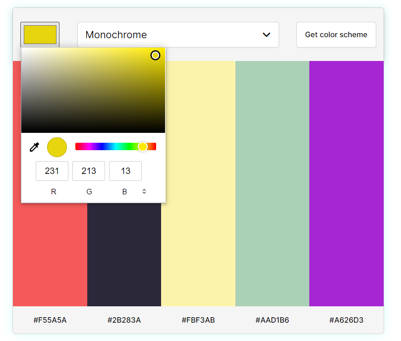
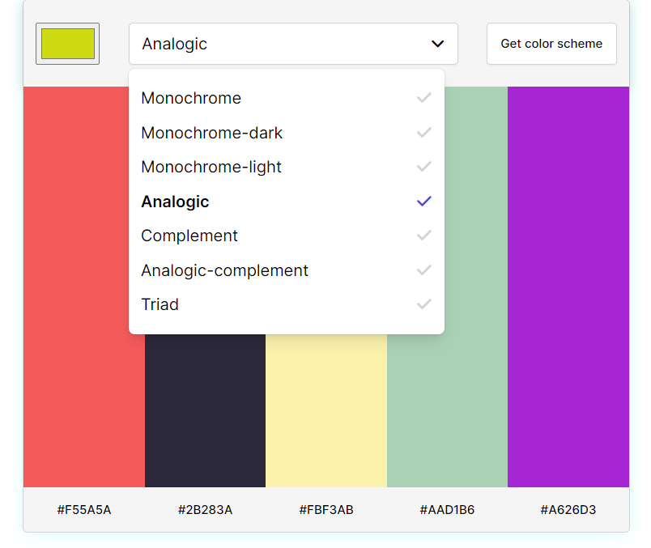
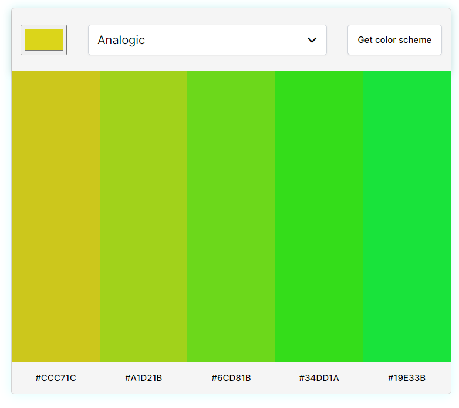
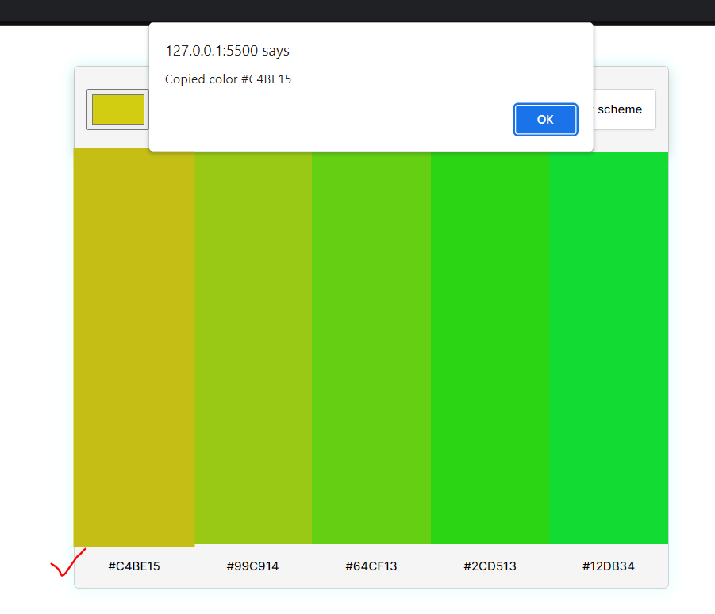

# Color Scheme Generator :

- This is a solo-project from [scrimba](https://scrimba.com/learn/frontend).
- Get your desired color shade by picking up color and shade value from the dropdown.
- Follow the steps below ,
    1. Choose a color input of your choice,   
         

    2. Choose a color scheme,   
        

    3. Click on "Get color scheme" button to get five colors,  
        

    4. Click on color shade or hex value to copy to clipboard,  
         

- **Used [Color_API](https://www.thecolorapi.com/) to fetch color shades.**